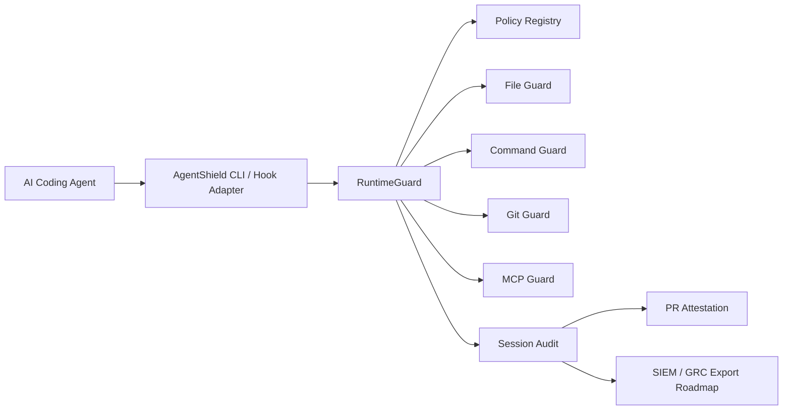

# TerraGuard AgentShield

**The agent firewall for regulated engineering.**

AI coding agents now read repositories, edit files, execute commands, connect to tools, create branches, and open pull requests. In banking, healthcare, public sector, PCI, and other regulated environments, that changes the control problem: governance cannot wait until code reaches CI.

TerraGuard AgentShield brings the TerraGuard policy philosophy to AI-agent runtime behavior. It evaluates what an AI coding agent is trying to read, change, execute, connect to, and attest before the action becomes a compliance issue.


## What AgentShield Controls

| Control area | Enterprise question | AgentShield capability |
| --- | --- | --- |
| Agent identity | Which AI tool acted, in which repo, under which policy? | Session metadata and audit evidence |
| File access | Can the agent read secrets or modify sensitive paths? | Sensitive file block and approval-required writes |
| Commands | Can the agent run `terraform apply`, cloud IAM commands, or destructive shell commands? | Command block, allow, and approval policy |
| Git | Can the agent push to protected branches or bypass PR review? | Protected branch decision checks and attestation |
| MCP/tools | Can the agent connect to unapproved tools or risky MCP servers? | MCP allowlist, blocklist, capability checks, risk scoring |
| Evidence | How do reviewers and auditors see what happened? | JSON session audit and PR-ready markdown attestation |

## Why This Exists

Traditional SDLC controls focus on output:

```text
AI agent writes code -> commit -> CI scan -> review
```

AgentShield moves governance earlier:

```text
AI agent intends action -> policy decision -> allow / warn / block / approval -> audit evidence
```

This matters because modern AI engineering tools are increasingly agentic. Claude Code documents lifecycle hooks around tool use, including `PreToolUse` and `PostToolUse`. GitHub documents Copilot cloud agent working independently in a GitHub Actions-powered environment where it can explore code, make changes, run tests, and open pull requests. OpenAI describes Codex as operating in a secure cloud execution environment and Codex CLI as a local coding agent. MCP standardizes external tools and resources for AI applications. AgentShield is designed for that operating model.

## Product Boundary

AgentShield is related to, but separate from, Terraform Guardrail.

| Product | Primary scope |
| --- | --- |
| Terraform Guardrail | IaC scanning, Terraform policy, compliance reporting, drift/evidence for infrastructure code |
| TerraGuard AgentShield | Runtime governance for AI coding agents across source code, IaC, shell, Git, and tool access |

The shared philosophy is policy-as-code plus audit evidence. Terraform Guardrail governs IaC outputs. AgentShield governs AI-agent behavior before those outputs reach Git.

## Install

For development:

```bash
git clone https://github.com/Huzefaaa2/terraguard-agentshield.git
cd terraguard-agentshield
python3 -m venv .venv
source .venv/bin/activate
pip install -e ".[dev]"
```

After PyPI publication:

```bash
pip install terraguard-agentshield
```

## Quick Start

Start a governed AI-agent session:

```bash
terraguard-agentshield agent start \
  --tool claude-code \
  --repo . \
  --policy-pack banking-regulated-ai \
  --output .terraguard/audit
```

Check a command before allowing an agent to run it:

```bash
terraguard-agentshield agent exec "terraform apply -auto-approve" \
  --policy-pack terraform-ai-guardrails
```

Check file access:

```bash
terraguard-agentshield agent check-file .env --mode read
terraguard-agentshield agent check-file platform/iam/role.tf --mode write \
  --policy-pack banking-regulated-ai
```

Check MCP server access:

```bash
terraguard-agentshield agent check-mcp github-enterprise \
  --capability read_repo \
  --policy-pack mcp-server-governance
```

Connect Claude Code `PreToolUse` hooks:

```bash
terraguard-agentshield hooks claude \
  --policy-pack banking-regulated-ai \
  --repo . \
  --audit-dir .terraguard/audit
```

Generate a PR attestation:

```bash
terraguard-agentshield agent attest <session-id> \
  --audit-dir .terraguard/audit \
  --format markdown
```

Validate audit evidence for a protected branch check:

```bash
terraguard-agentshield evidence validate \
  --audit-dir .terraguard/audit \
  --require-policy-pack banking-regulated-ai \
  --fail-on block,require_approval
```

Send evidence to an enterprise webhook or SIEM endpoint:

```bash
terraguard-agentshield evidence send-webhook <session-id> \
  --audit-dir .terraguard/audit \
  --url https://security.example.com/agentshield/events \
  --retries 3 \
  --backoff-seconds 2
```

Publish or update a GitHub PR attestation comment:

```bash
terraguard-agentshield evidence publish-github-comment \
  --session-id <session-id> \
  --audit-dir .terraguard/audit \
  --repo owner/repo \
  --pr-number 123
```

Sign and verify a policy bundle:

```bash
export TERRAGUARD_AGENTSHIELD_POLICY_SECRET="replace-me"
terraguard-agentshield policy sign policies/banking-regulated-ai/policy.yaml \
  --signer platform-security
terraguard-agentshield policy verify policies/banking-regulated-ai/policy.yaml
```

## Policy Packs

Built-in policy packs:

| Pack | Purpose |
| --- | --- |
| `ai-agent-baseline` | General controls for sensitive files, destructive commands, and protected branches |
| `banking-regulated-ai` | Stronger rules for regulated financial engineering environments |
| `terraform-ai-guardrails` | Terraform/OpenTofu runtime controls for AI-assisted IaC work |
| `mcp-server-governance` | MCP server allowlisting, risk scoring, and capability restrictions |

Example policy:

```yaml
filesystem:
  block_read:
    - ".env"
    - "**/*.pem"
    - "**/terraform.tfstate"
  require_approval_write:
    - "**/iam/**"
    - "**/security/**"

commands:
  block:
    - "terraform apply*"
    - "kubectl delete*"
  require_approval:
    - "aws *"
    - "curl *"
  allow:
    - "terraform plan*"
    - "pytest*"

mcp:
  allowlist_enabled: true
  block_unknown_servers: true
  allowed_servers:
    - github-enterprise
    - jira-enterprise
```

## Architecture



More detail:

- [Architecture](docs/architecture.md)
- [C4 Model](docs/c4-model.md)
- [Threat Model](docs/threat-model.md)
- [Implementation Guide](docs/implementation-guide.md)
- [Claude Code Hooks](docs/claude-code-hooks.md)
- [Policy Signing](docs/policy-signing.md)
- [Attestation Validation](docs/attestation-validation.md)
- [Codex and Copilot Governance](docs/codex-copilot-governance.md)
- [Policy Authoring](docs/policy-authoring.md)
- [Enterprise Adoption](docs/enterprise-adoption.md)
- [Case Studies](docs/case-studies.md)
- [Roadmap](docs/roadmap.md)
- [Wiki source pages](docs/wiki/Home.md)

## Current Enterprise Foundation Status

Implemented:

- JSON/YAML policy registry
- Built-in policy packs
- File read/write decisions with block and approval-required outcomes
- Command decisions with block, allow, and approval-required outcomes
- MCP allowlist/blocklist/capability decisions
- Claude Code `PreToolUse` hook adapter
- Protected branch git decision model
- Session audit JSON
- PR-ready markdown attestation
- Webhook evidence sender with optional HMAC signing
- Detached policy signatures with HMAC-SHA256
- CI attestation validation for protected branch checks
- GitHub PR comment publishing for AgentShield reports
- Codex and Copilot governance examples
- Retryable webhook delivery plus Splunk/Sentinel receiver examples
- Typer CLI
- Unit tests for runtime, policy registry, and integrations

Next:

- Jira/ServiceNow evidence routing
- Semantic diff/risk engine

## References

- Claude Code Hooks: https://docs.claude.com/en/docs/claude-code/hooks
- GitHub Copilot cloud agent: https://docs.github.com/en/copilot/concepts/agents/cloud-agent/about-cloud-agent
- OpenAI Codex: https://openai.com/index/introducing-codex/
- Model Context Protocol: https://modelcontextprotocol.io/docs/learn/architecture
