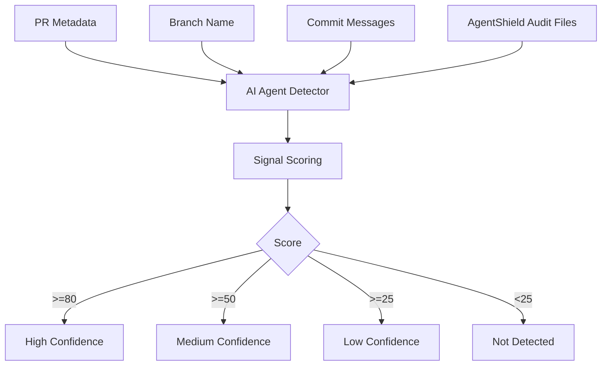

# AI Agent Detector

AI Agent Detector estimates whether a change appears to be produced or assisted by an autonomous or semi-autonomous AI coding agent. It is deterministic: no LLM calls, no external services, and no network dependency.

## Detection Philosophy

The detector uses explicit signals rather than guessing from code style. A Copilot branch, Codex marker, Claude Code audit session, or Cursor commit message is stronger than generic language such as `assistant`.

Dependabot and Renovate are automation bots, not AI coding agents. They are labeled as `automation-bot` with low confidence and do not set `detected=true` unless another AI-agent signal exists.

## Signals

| Signal | Confidence | Examples |
| --- | --- | --- |
| Branch name | High | `copilot/*`, `codex/*`, `claude/*`, `cursor/*`, `ai-agent/*` |
| Commit or PR text | High | `Generated with Claude Code`, `OpenAI Codex`, `Co-authored-by: GitHub Copilot` |
| Author identity | High | `github-copilot`, `codex`, `claude`, `cursor` |
| AgentShield audit metadata | High | `tool: claude-code`, `tool: codex` |
| Generic PR wording | Medium | `AI assisted`, `AI-generated`, `agent` |
| Repo context | Low | `.github/copilot-instructions.md` present |

## Score Thresholds

| Score | Confidence | Detected |
| ---: | --- | --- |
| `>= 80` | high | true |
| `>= 50` | medium | true |
| `>= 25` | low | true |
| `< 25` | none | false |

## CLI

```bash
terraguard-agentshield agent detect \
  --repo . \
  --branch "$GITHUB_HEAD_REF" \
  --event-path "$GITHUB_EVENT_PATH" \
  --audit-dir .terraguard/audit \
  --format json
```

## JSON Example

```json
{
  "detected": true,
  "confidence": "high",
  "score": 95,
  "agent_type": "github-copilot",
  "signals": [
    {
      "source": "branch",
      "value": "copilot/fix-terraform-policy",
      "weight": 45,
      "agent_type": "github-copilot",
      "description": "Branch name matches known Copilot pattern."
    }
  ],
  "recommendation": "Review this PR with AI-agent governance controls enabled."
}
```

## Flow



## Known Limitations

- It detects explicit operational signals, not writing style.
- It cannot prove that a human did or did not use an AI assistant.
- It should be used as governance context, not as a disciplinary signal.
