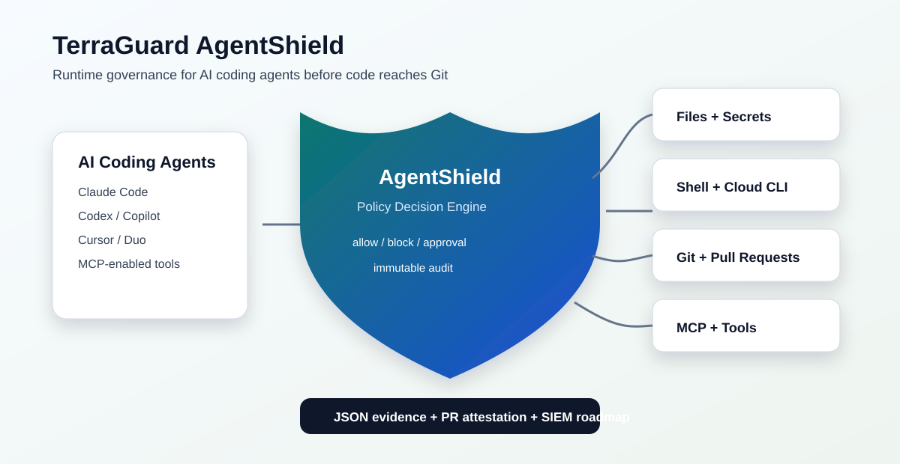
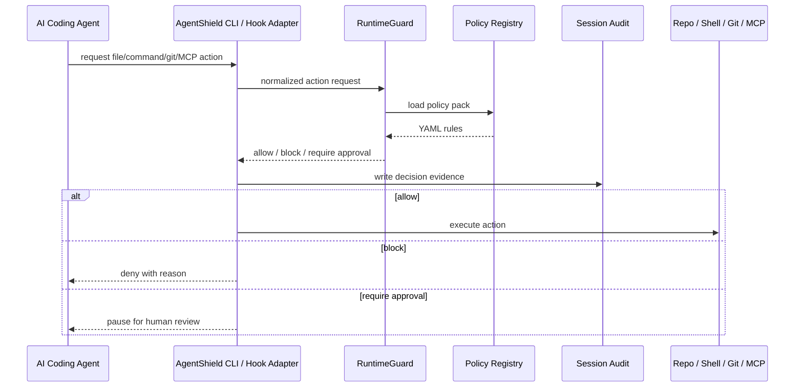
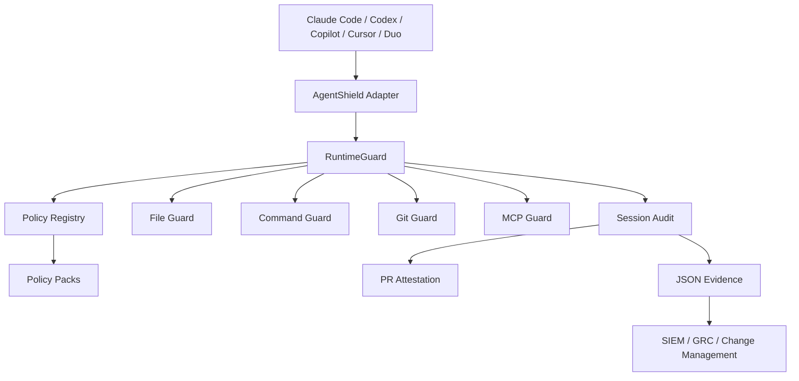

# Architecture

TerraGuard AgentShield is a runtime governance layer for AI coding agents. It is designed to sit between an agent action and the engineering environment, evaluate that action against policy, and write evidence that humans and auditors can understand.

## Design Principles

1. **Runtime first**: evaluate agent behavior before it becomes a Git diff, cloud change, or leaked secret.
2. **Policy-as-code**: store controls in YAML packs that can be reviewed, versioned, and reused.
3. **Human approval remains explicit**: AI-assisted review is not treated as independent human approval.
4. **Evidence by default**: every governed session can produce JSON audit and PR attestation.
5. **Tool-neutral**: support Claude Code, Codex-style agents, GitHub Copilot cloud/CLI flows, Cursor, Duo, and future MCP-enabled tools.

## Runtime Flow

## Core Components

| Component | Module | Responsibility |
| --- | --- | --- |
| CLI | `terraguard_agentshield.cli` | User-facing commands for sessions, file checks, command checks, MCP checks, and attestation |
| Claude hook processor | `terraguard_agentshield.hooks` | Converts Claude Code hook payloads into AgentShield runtime decisions |
| Session manager | `terraguard_agentshield.agent` | Creates session IDs and initializes session audit records |
| Runtime guard | `terraguard_agentshield.runtime` | Evaluates file, command, Git, and MCP actions |
| Policy registry | `terraguard_agentshield.policy_registry` | Loads built-in or custom YAML policy packs |
| Audit model | `terraguard_agentshield.audit` | Serializes session decisions into JSON and markdown reports |
| Integrations | `terraguard_agentshield.integrations` | Command interception and PR attestation export |

## Decision Model

AgentShield uses three primary decisions:

| Decision | Meaning |
| --- | --- |
| `allow` | Action can proceed and is recorded |
| `block` | Action must not proceed |
| `require_approval` | Action is paused until an independent human approval process handles it |

Policy precedence:

1. Explicit block rules
2. Explicit approval-required rules
3. Explicit allow rules
4. Default approval-required for unknown commands

## Policy Pack Loading

AgentShield loads policies from:

1. A custom root supplied to `PolicyRegistry(root=...)`
2. The repository `policies/` directory during development
3. Packaged built-in policies under `terraguard_agentshield/policies/` after installation

This keeps local development and PyPI installation behavior consistent.

## Enforcement Surfaces

### File Guard

Controls:

- `filesystem.block_read`
- `filesystem.block_write`
- `filesystem.require_approval_write`

Use cases:

- Prevent `.env`, private keys, certificates, Terraform state, and tfvars from entering AI context.
- Require review before AI agents modify IAM, security, policy, workflow, or backend files.

### Command Guard

Controls:

- `commands.block`
- `commands.require_approval`
- `commands.allow`

Use cases:

- Block autonomous `terraform apply`, `kubectl delete`, cloud IAM creation, force pushes, or destructive shell commands.
- Allow safe commands such as `terraform plan`, `pytest`, and `npm test`.
- Require approval for unknown or high-risk commands.

### Git Guard

Controls:

- `git.block_direct_push_to_protected_branch`
- `git.protected_branches`
- `git.require_pull_request`
- `git.require_human_reviewer`
- `git.require_ai_attestation`

The current enterprise foundation evaluates protected branch push decisions locally and provides CI attestation validation. Future releases will integrate deeper with GitHub/GitLab branch protection APIs.

### MCP Guard

Controls:

- `mcp.allowlist_enabled`
- `mcp.block_unknown_servers`
- `mcp.allowed_servers`
- `mcp.blocked_servers`
- `mcp.capabilities`
- `mcp.risk_scoring`

Use cases:

- Allow enterprise GitHub/Jira/Confluence MCP servers.
- Block personal drive, unknown filesystem, or public browser MCP servers.
- Restrict dangerous capabilities such as force push and repository deletion.

## Deployment Patterns

| Pattern | Use case | Status |
| --- | --- | --- |
| Local CLI wrapper | Developer manually checks commands/files/MCP before agent action | Implemented |
| Claude Code hook adapter | `PreToolUse` policy enforcement for Bash, files, and MCP tools | Implemented |
| GitHub PR attestation | Attach AI governance report to PR | Partially implemented |
| CI policy check | Require attestation and policy pack validation in GitHub Actions | Implemented |
| Enterprise evidence export | Send audit to SIEM/GRC/ServiceNow/Jira | Roadmap |

## Reference Architecture

