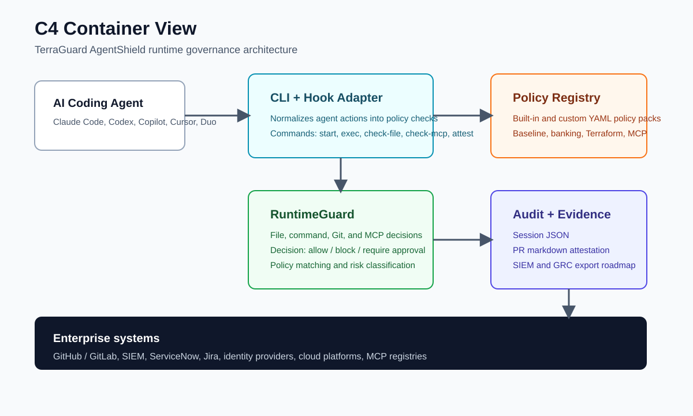
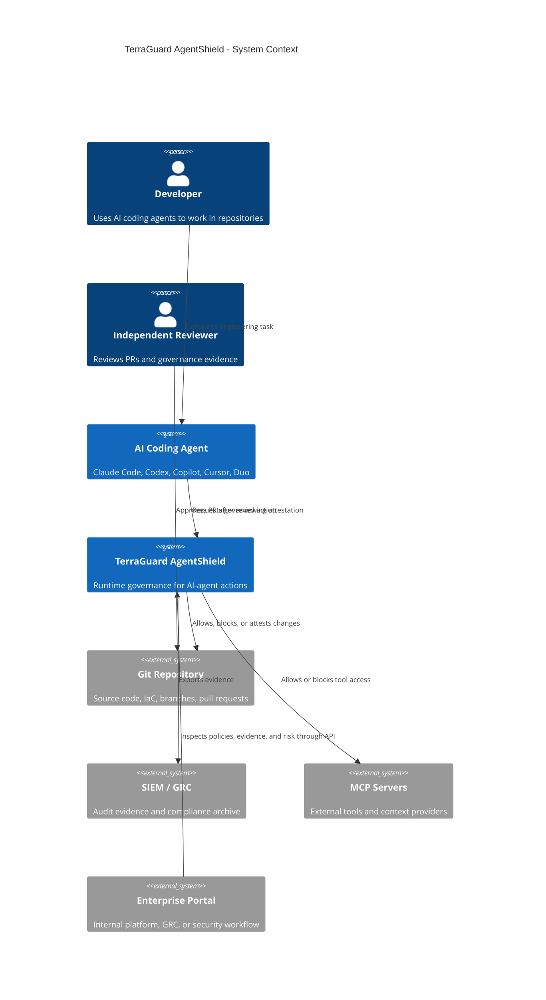
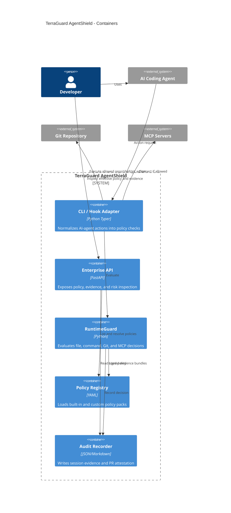
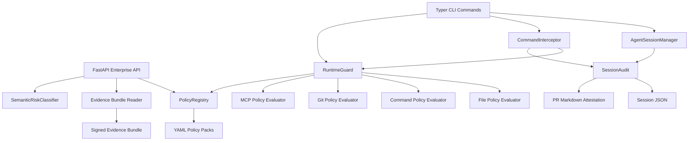
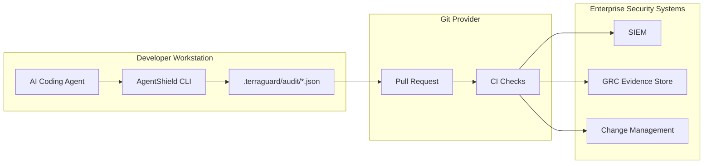

# C4 Model

This page documents TerraGuard AgentShield using the C4 model: system context, container, component, and deployment views.

## Level 1: System Context

## Level 2: Container View

## Level 3: Component View

## Level 4: Deployment View

## Current C4 Status

| Area | Status |
| --- | --- |
| Local CLI adapter | Implemented |
| Runtime policy decision engine | Implemented |
| Packaged policy packs | Implemented |
| JSON audit and markdown attestation | Implemented |
| Claude Code hook adapter | Implemented |
| Policy signing | Implemented |
| Attestation validation | Implemented |
| GitHub PR comment publishing | Implemented |
| GitHub Action attestation validation | Example provided |
| SIEM/GRC/change evidence exporters | Implemented foundation |
| Enterprise API | Implemented foundation |
| Hardened deployment examples | Implemented foundation |
| Decision summary | Implemented foundation |
