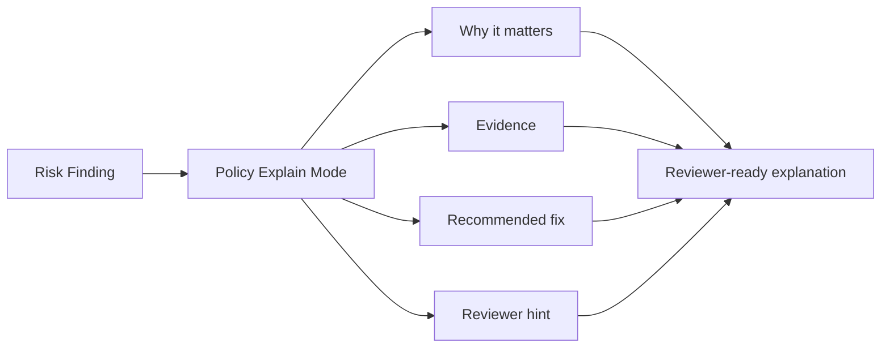

# Policy Explain Mode

Policy Explain Mode turns risk findings into reviewer-ready explanations. It explains what happened, why it matters, what evidence triggered the finding, how to remediate it, and who should review it.

No LLM or external service is used. The output is deterministic and based on AgentShield risk categories.

## CLI

```bash
terraguard-agentshield policy explain \
  --risk agentshield-risk.json \
  --policy-pack banking-regulated-ai \
  --fail-on high \
  --format markdown \
  --output agentshield-policy-explanation.md
```

## Explanation Schema

Each explanation item includes:

- risk
- category
- title
- why it matters
- evidence
- file and line
- recommendation
- control family
- reviewer hint

## Category Mapping

| Category | Why it matters | Recommended fix |
| --- | --- | --- |
| `secrets` | Credential material may enter source control or agent context | Move secrets to an approved secret manager |
| `public-exposure` | Internet-exposed ingress can expose systems or data | Restrict CIDR ranges and require security approval |
| `privilege-expansion` | Wildcard or admin permissions violate least privilege | Replace wildcard/admin access with exact scope |
| `encryption` | Data protection controls are weakened or removed | Keep encryption enabled with approved keys |
| `logging` | Auditability and incident response visibility may be reduced | Keep audit logging enabled |
| `tls` | Disabling certificate verification enables MITM risk | Keep verification enabled |
| `crypto` | Weak primitives can break confidentiality or integrity | Use approved modern algorithms |
| `sensitive-code` | Auth, identity, token, or payment code needs independent review | Require a qualified reviewer |

## Reviewer Hints

| Control family | Reviewer |
| --- | --- |
| `identity-access` | Security/IAM approver |
| `network-security` | Network/security approver |
| `data-protection` | Security/data protection approver |
| `audit-monitoring` | SRE/security monitoring approver |
| `application-security` | AppSec approver |

## Flow



## PR Guardian Usage

PR Guardian embeds a condensed policy explanation inside the PR comment and writes the full explanation to `agentshield-policy-explanation.md`.
