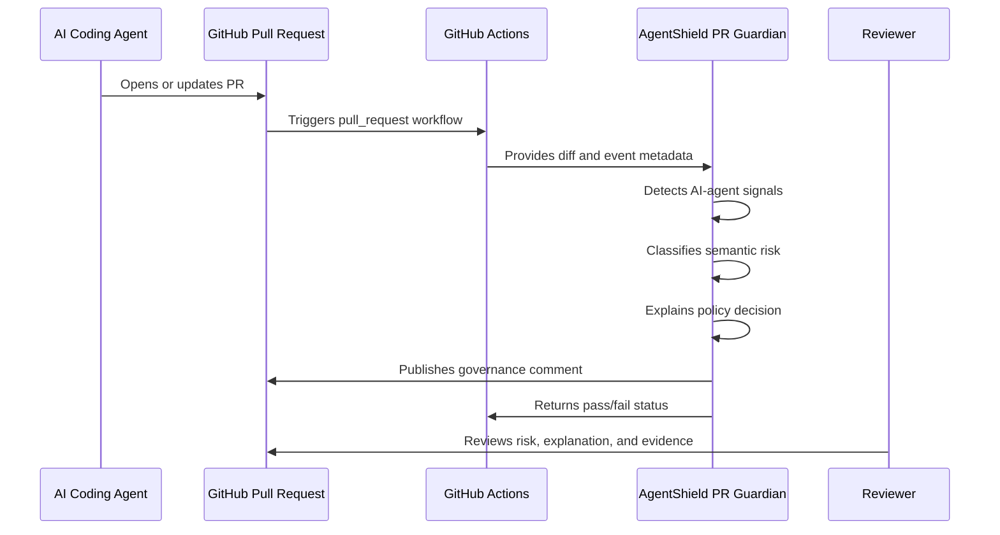

# AgentShield PR Guardian

AgentShield PR Guardian is a pull-request firewall for AI-assisted engineering. It reads a PR diff, detects AI-agent signals, classifies semantic risk, explains policy decisions, writes audit artifacts, and can publish one reviewer-ready GitHub comment.

## Why DevOps Teams Need It

Traditional CI checks inspect code after it has been written. PR Guardian gives reviewers context about how risky the change is, whether an AI coding agent appears to be involved, what policy concern was triggered, and which reviewer group should look at it.

## Install

```bash
pip install terraguard-agentshield
```

For local development:

```bash
pip install -e ".[dev]"
```

## Local CLI

```bash
git diff origin/main...HEAD > change.diff

terraguard-agentshield pr guard \
  --diff change.diff \
  --policy-pack banking-regulated-ai \
  --fail-on high \
  --output-dir .terraguard/agentshield/pr-guardian
```

## GitHub Actions

Copy `examples/github-actions/agentshield-pr-guardian.yml` into `.github/workflows/`.

Required permissions:

```yaml
permissions:
  contents: read
  pull-requests: write
  issues: write
  checks: write
```

## Inputs

| Option | Purpose |
| --- | --- |
| `--diff` | Unified PR diff to evaluate |
| `--repo` | GitHub repository in `owner/name` format |
| `--pr-number` | Pull request number |
| `--policy-pack` | Policy pack label for report context |
| `--fail-on` | Risk threshold: `low`, `medium`, `high`, `critical` |
| `--publish-comment` | Publish or update a GitHub PR comment |
| `--dry-run` | Write reports without calling GitHub |

## Outputs

Artifacts are written to `.terraguard/agentshield/pr-guardian` by default:

- `agentshield-pr-guardian.json`
- `agentshield-pr-guardian.md`
- `agentshield-policy-explanation.md`

## Exit Codes

| Code | Meaning |
| --- | --- |
| `0` | Risk is below threshold |
| `1` | Risk meets or exceeds threshold, or publishing failed |
| `2` | Configuration or input error |

## Flow



## Troubleshooting

- If no comment appears, verify `--publish-comment` is set and `GITHUB_TOKEN` is available.
- If the command exits `1`, inspect `agentshield-pr-guardian.md` for findings and remediation.
- If the command exits `2`, verify the diff path and PR metadata inputs.
