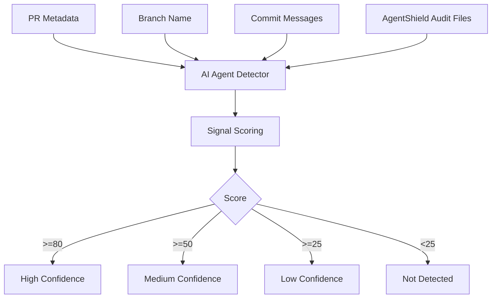

# AI Agent Detector

AI Agent Detector estimates whether a change appears to be produced or assisted by an AI coding agent. It uses deterministic signals only: no LLM calls, no external services, and no network dependency.

## Signals

| Signal | Examples |
| --- | --- |
| Branch name | `copilot/*`, `codex/*`, `claude/*`, `cursor/*`, `ai-agent/*` |
| Commit or PR text | `Generated with Claude Code`, `OpenAI Codex`, `Co-authored-by: GitHub Copilot` |
| Author identity | `github-copilot`, `codex`, `claude`, `cursor` |
| AgentShield audit metadata | `tool: claude-code`, `tool: codex` |
| Repo context | `.github/copilot-instructions.md` |

Dependabot and Renovate alone are automation bots, not AI coding agents.

## CLI

```bash
terraguard-agentshield agent detect \
  --repo . \
  --branch "$GITHUB_HEAD_REF" \
  --event-path "$GITHUB_EVENT_PATH" \
  --format markdown
```


