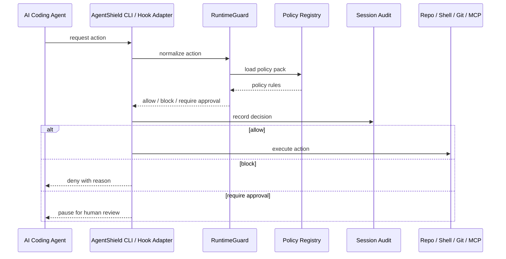

# Architecture

## Runtime Flow

## Components

| Component | Responsibility |
| --- | --- |
| CLI / hook adapter | Normalizes agent actions into policy checks |
| Enterprise API | Lets enterprise systems inspect policies, evidence bundles, and diff risk |
| RuntimeGuard | Evaluates file, command, Git, and MCP decisions |
| Policy Registry | Loads YAML policy packs |
| Audit Recorder | Writes JSON evidence and markdown attestation |
| Policy Packs | Define enterprise controls |
| Deployment examples | Provide hardened Docker, Compose, Nginx, and Kubernetes starting points |
| Approval routing | Maps risk and control-family summaries to approver groups |
| Policy test harness | Validates policy-pack behavior before rollout |
| Compliance mappings | Maps control families to common compliance frameworks |
| Generated reports | Combine validation, decision summaries, approval routing, and compliance mappings |

## Decisions

- `allow`: action can proceed.
- `block`: action must not proceed.
- `require_approval`: human approval is required before proceeding.
