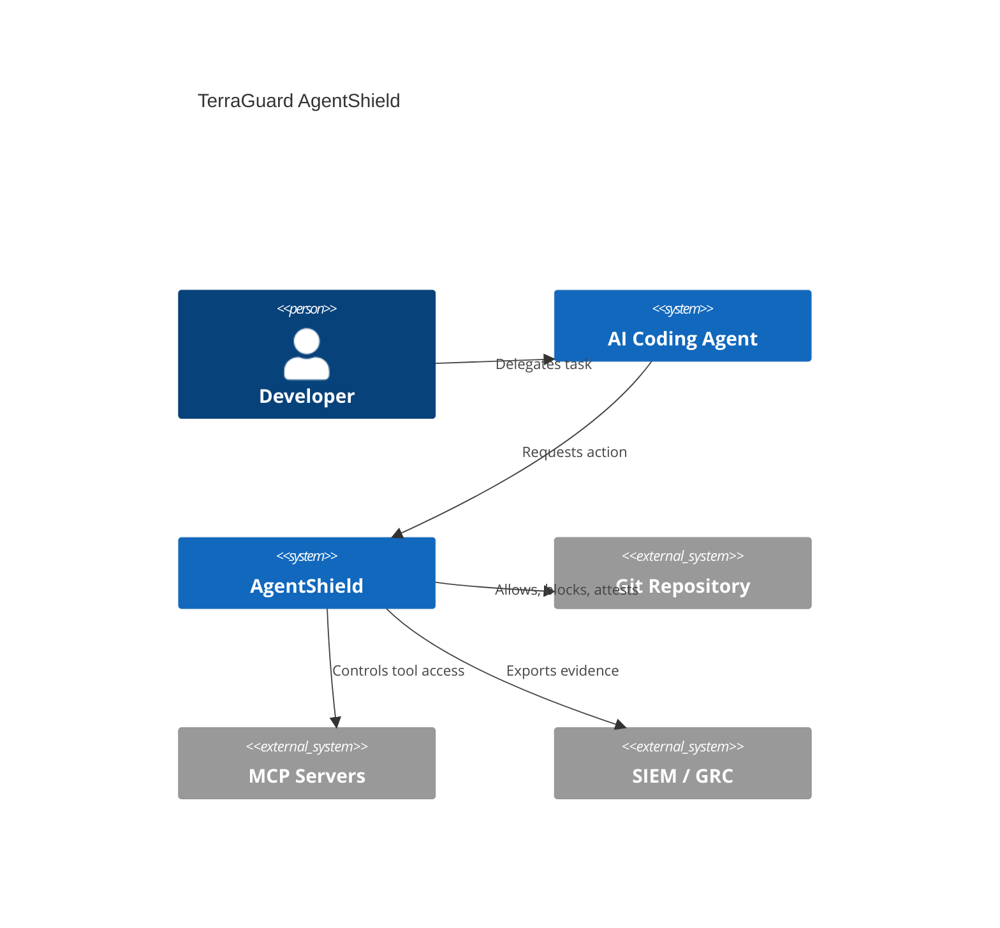
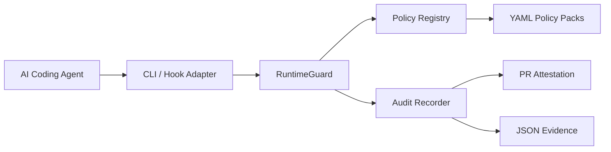

# C4 Model

## System Context

```mermaid
C4Context
    title TerraGuard AgentShield
    Person(dev, "Developer")
    System(agent, "AI Coding Agent")
    System(ags, "AgentShield")
    System_Ext(repo, "Git Repository")
    System_Ext(mcp, "MCP Servers")
    System_Ext(siem, "SIEM / GRC")
    Rel(dev, agent, "Delegates task")
    Rel(agent, ags, "Requests action")
    Rel(ags, repo, "Allows, blocks, attests")
    Rel(ags, mcp, "Controls tool access")
    Rel(ags, siem, "Exports evidence")
```

## Container View

```mermaid
flowchart LR
    Agent[AI Coding Agent] --> CLI[CLI / Hook Adapter]
    CLI --> Guard[RuntimeGuard]
    Guard --> Registry[Policy Registry]
    Registry --> Packs[YAML Policy Packs]
    Guard --> Audit[Audit Recorder]
    Audit --> PR[PR Attestation]
    Audit --> JSON[JSON Evidence]
```
