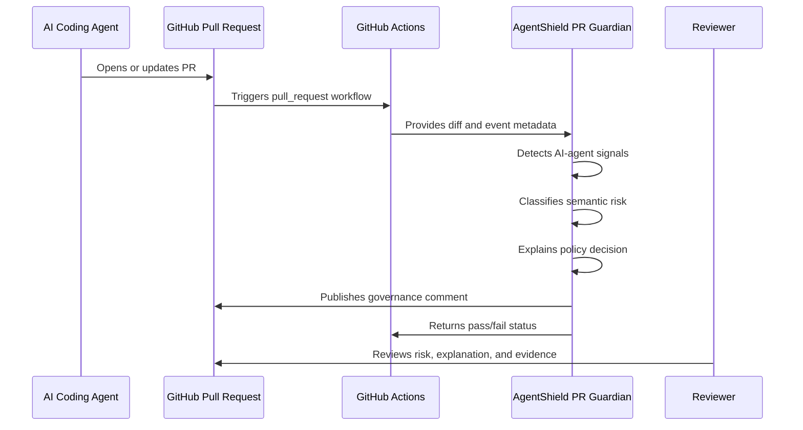

# AgentShield PR Guardian

PR Guardian is a GitHub-native pull-request firewall for AI-assisted engineering. It reads a PR diff, detects AI-agent signals, classifies semantic risk, explains policy decisions, writes evidence artifacts, and can publish one reviewer-ready PR comment.

## Local Use

```bash
git diff origin/main...HEAD > change.diff

terraguard-agentshield pr guard \
  --diff change.diff \
  --policy-pack banking-regulated-ai \
  --fail-on high \
  --output-dir .terraguard/agentshield/pr-guardian
```

## GitHub Actions

Copy `examples/github-actions/agentshield-pr-guardian.yml` into `.github/workflows/`.

Artifacts:

- `agentshield-pr-guardian.json`
- `agentshield-pr-guardian.md`
- `agentshield-policy-explanation.md`

Exit codes:

| Code | Meaning |
| --- | --- |
| `0` | Risk is below threshold |
| `1` | Risk meets or exceeds threshold, or publishing failed |
| `2` | Configuration or input error |


