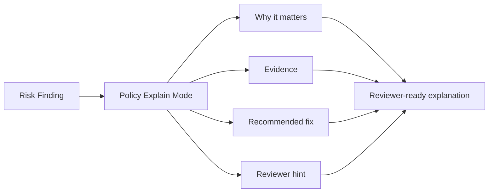

# Policy Explain Mode

Policy Explain Mode converts AgentShield risk findings into reviewer-ready explanations. It explains why a finding matters, which evidence triggered it, how to fix it, and who should review it.

## CLI

```bash
terraguard-agentshield policy explain \
  --risk agentshield-risk.json \
  --policy-pack banking-regulated-ai \
  --fail-on high \
  --format markdown \
  --output agentshield-policy-explanation.md
```

## Reviewer Hints

| Control family | Reviewer |
| --- | --- |
| `identity-access` | Security/IAM approver |
| `network-security` | Network/security approver |
| `data-protection` | Security/data protection approver |
| `audit-monitoring` | SRE/security monitoring approver |
| `application-security` | AppSec approver |


